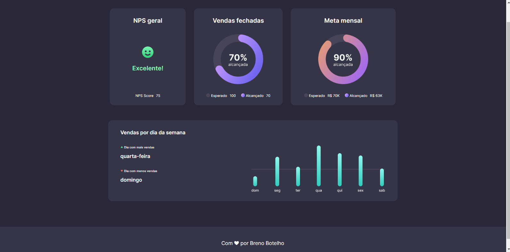
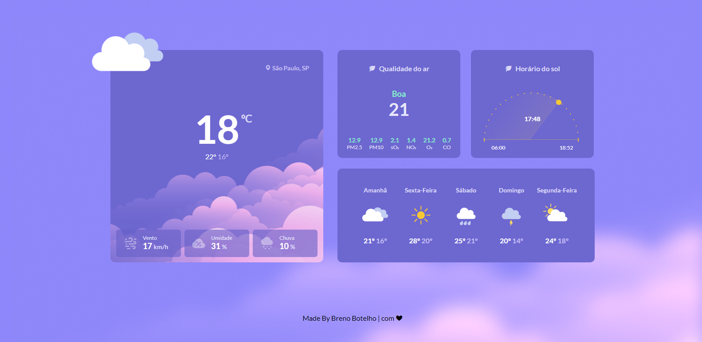
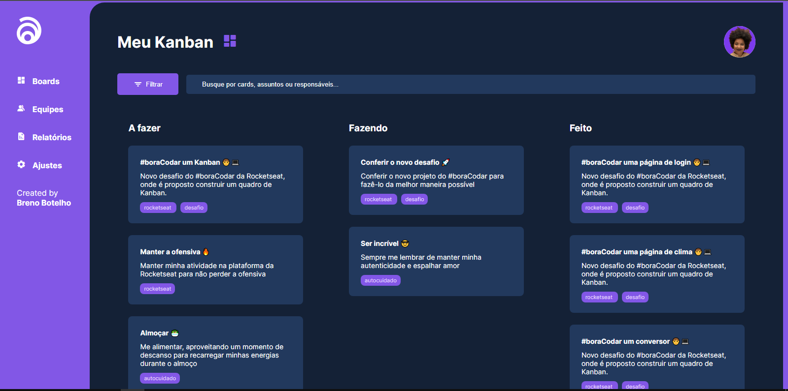
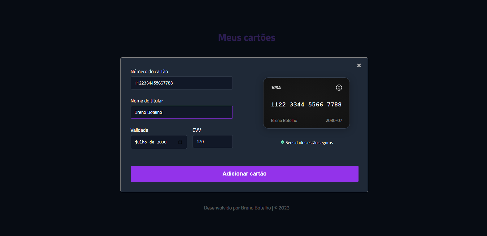
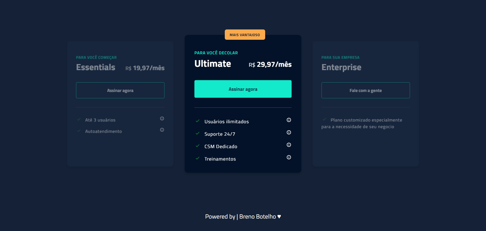
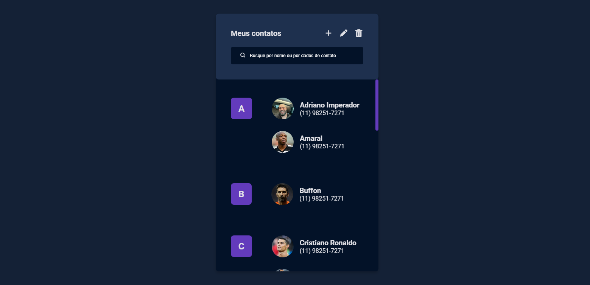
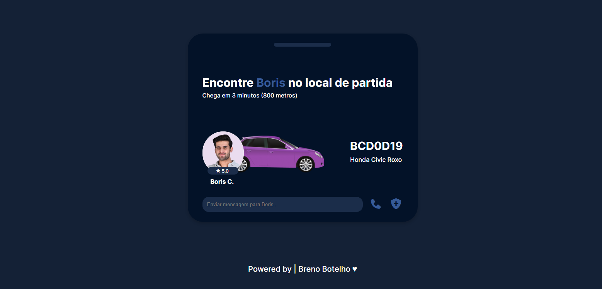
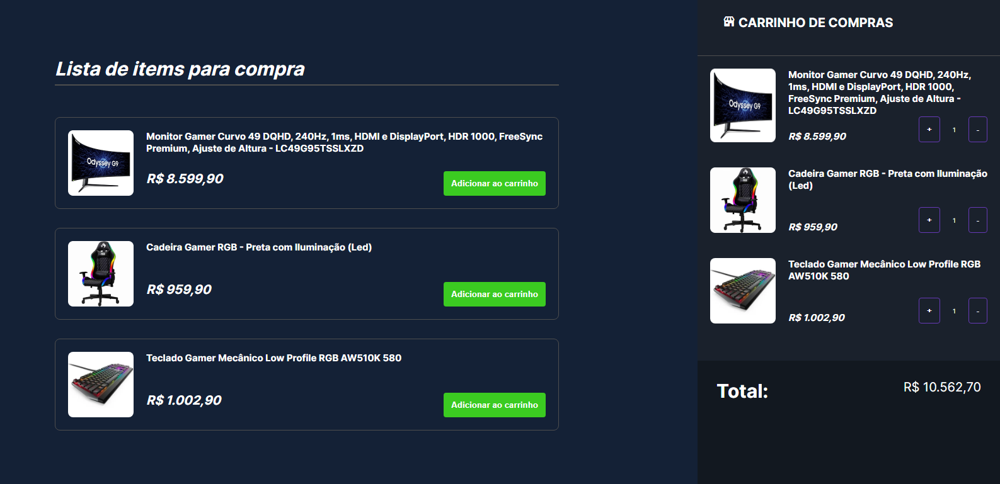
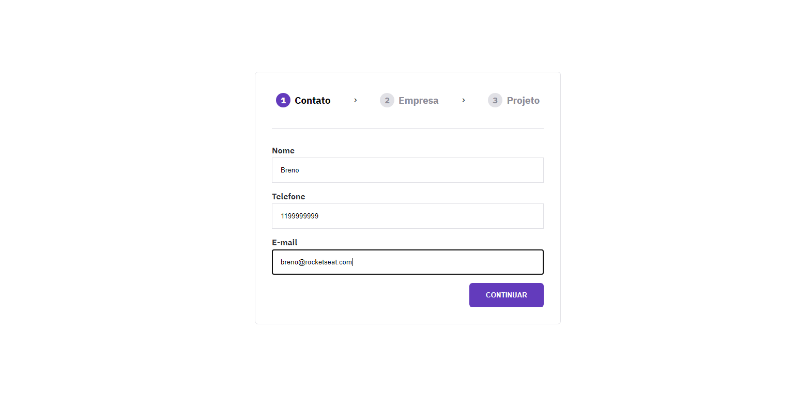

# Desafios #boraCodar 2023 | 👾

📌 **Desafios semanais do [#boraCodar](https://www.rocketseat.com.br/boracodar) proposto pela comunidade [Rocketseat](https://www.rocketseat.com.br). 
Tenho buscado me desafiar cada vez mais e desenvolver o meu aprendizado explorando novas tecnologias e idéias. Entre, confira e participe!**

Acompanhe as postagens dos desafios no meu [Linkedin](https://br.linkedin.com/in/breno-botelho?trk=public_profile_browsemap) e vamos trocar uma idéia!  

🖊 _Estou começando a participar dos desafios a partir do 06 (cartão de embarque). Logo mais eu faço os anteriores e posto aqui também!_

🎯 [Paticipe você também dos desafios!](https://boracodar.dev/)!

# 💎 Confira minhas participações logo abaixo 

|   #  |    Nome        | Code  | Deploy   |  |
| :--- | :------------- | :---- | :--------| :------|
| `06` | `Cartão de embarque` |  [✍](https://github.com/brenobotelho/boracodar/tree/main/desafio6) |[💻](https://brenobotelho.github.io/boracodar/desafio6/) | 
| `07` | `Encontre os melhores blocos de carnaval` |  [✍](https://github.com/brenobotelho/boracodar/tree/main/desafio7) |[💻](https://brenobotelho.github.io/boracodar/desafio7/) | 
| `08` | `Dashboard` | [✍](https://github.com/brenobotelho/boracodar/tree/main/desafio8) |[💻](https://brenobotelho.github.io/boracodar/desafio8/) | 
| `09` | `Conversor de Moeda` | [✍](https://github.com/brenobotelho/boracodar/tree/main/desafio9) |[💻](https://brenobotelho.github.io/boracodar/desafio9/) | 
| `10` | `Página de Clima` | [✍](https://github.com/brenobotelho/boracodar/tree/main/desafio10) |[💻](https://brenobotelho.github.io/boracodar/desafio10/) | 
| `11` | `Página de Login` | [✍](https://github.com/brenobotelho/boracodar/tree/main/desafio11) |[💻](https://brenobotelho.github.io/boracodar/desafio11/) | 
| `12` | `Plataforma de Kanban` | [✍](https://github.com/brenobotelho/boracodar/tree/main/desafio12) |[💻](https://brenobotelho.github.io/boracodar/desafio12/) | 
| `13` | `Formulário de Cartão de Crédito` | [✍](https://github.com/brenobotelho/boracodar/tree/main/desafio13) |[💻](https://brenobotelho.github.io/boracodar/desafio13/) | 
| `14` | `Componente de Upload` | [✍](https://github.com/brenobotelho/boracodar/tree/main/desafio14) |[💻](https://brenobotelho.github.io/boracodar/desafio14/) | 
| `15` | `Pricing Table` | [✍](https://github.com/brenobotelho/boracodar/tree/main/desafio15) |[💻](https://brenobotelho.github.io/boracodar/desafio15/) | 
| `16` | `Página de Contatos` | [✍](https://github.com/brenobotelho/boracodar/tree/main/desafio16) |[💻](https://brenobotelho.github.io/boracodar/desafio16/) | 
| `17` | `Date Picker` | [✍](https://github.com/brenobotelho/boracodar/tree/main/desafio17) |[💻](https://brenobotelho.github.io/boracodar/desafio17/) | 
| `18` | `Card de Personagem` | [✍](https://github.com/brenobotelho/boracodar/tree/main/desafio18) |[💻](https://brenobotelho.github.io/boracodar/desafio18/) | 
| `19` | `Widget de Transporte` | [✍](https://github.com/brenobotelho/boracodar/tree/main/desafio19) |[💻](https://brenobotelho.github.io/boracodar/desafio19/) | 
| `20` | `Galeria com Hover` | [✍](https://github.com/brenobotelho/boracodar/tree/main/desafio20) |[💻](https://brenobotelho.github.io/boracodar/desafio20/) | 
| `21` | `Carrinho de Compras` | [✍](https://github.com/brenobotelho/boracodar/tree/main/desafio21) |[💻](https://brenobotelho.github.io/boracodar/desafio21/) | 
| `22` | `Profile Settings` | [✍](https://github.com/brenobotelho/boracodar/tree/main/desafio22) |[💻](https://brenobotelho.github.io/boracodar/desafio22/) | 
| `23` | `Formulário Multi Step` | [✍](https://github.com/brenobotelho/boracodar/tree/main/desafio23) |[💻](https://brenobotelho.github.io/boracodar/desafio23/) | 

# 👤 Autor

**Breno Botelho**

👾 _Me siga nas redes sociais!_

- Github: [@brenobotelho](https://github.com/brenobotelho)
- Instagram: [@brenobotelho_](https://instagram.com/@brenobotelho_)
- Facebook: [Breno Botelho](https://facebook.com/BrenooBotelho)
- Linkedin: [Breno B.](https://br.linkedin.com/in/breno-botelho?trk=public_profile_browsemap)
