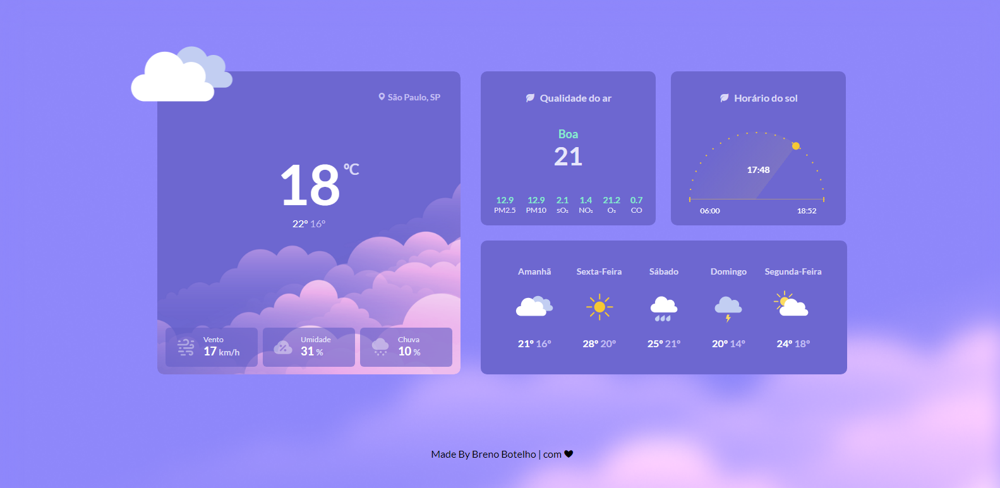

<h1 align="center"> 👾 #BoraCodar | Desafio 10 | Página de Clima 👾 </h1>

    <i> "Desenvolva um site de clima" </i> 
      Este é o meu décimo desafio <a href="https://boracodar.dev/">#BoraCodar</a> da RocketSeat.

## 🚀 Tecnologias

Esse projeto foi desenvolvido com as seguintes tecnologias:

- HTML
- CSS
- Gráfico SVG
- Github
- Figma

## 💻 Projeto

Este site tem como objetivo a visualização climática de sua cidade, onde mostra a temperatura atual (em grau celsius), a qualidade do ar, o horário do sol e a previsão do tempo dos próximos dias.  

Projeto construído a partir do layout proposto no desafio [#BoraCodar10](https://boracodar.dev/) realizado pela [Rocketseat](https://rocketseat.com.br).  

📌 Utilizei o HTML para marcação do site, CSS para estilização e o Figma como base da criação do projeto front-end. **Não utilizei ainda uma API para interatividade dos usuários (farei em breve)**

## 📑 Deploy

Acesse o site [clicando aqui](https://brenobotelho.github.io/boracodar/desafio10/).

# 👤 Autor

**Breno Botelho**

👾 _Me siga nas redes sociais!_

- Github: [@brenobotelho](https://github.com/brenobotelho)
- Instagram: [@brenobotelho_](https://instagram.com/@brenobotelho_)
- Facebook: [Breno Botelho](https://facebook.com/BrenooBotelho)
- Linkedin: [Breno B.](https://br.linkedin.com/in/breno-botelho?trk=public_profile_browsemap)
