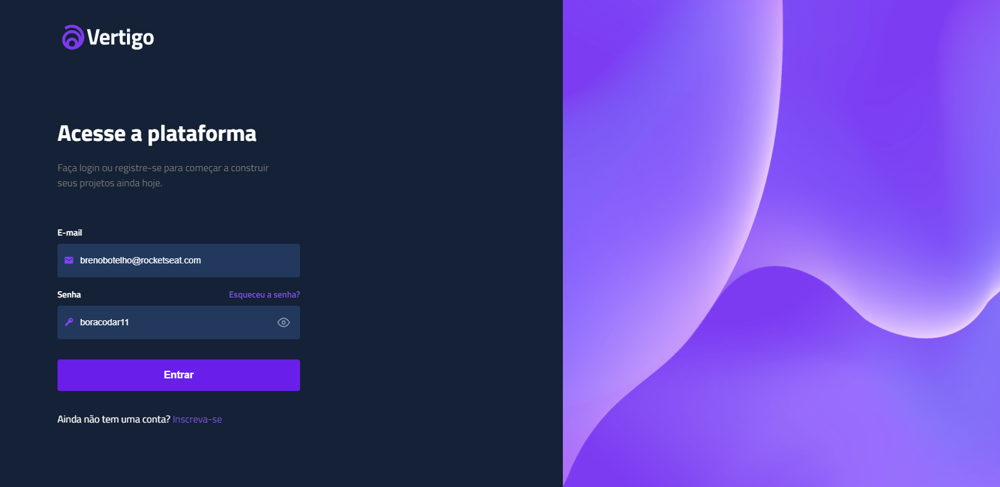

<h1 align="center"> 👾 #BoraCodar | Desafio 11 | Página de Login 👾 </h1>

    <i> "Desenvolva uma página de login" </i> 
      Este é o meu décimo primeiro desafio <a href="https://boracodar.dev/">#BoraCodar</a> da RocketSeat.

## 🚀 Tecnologias

Esse projeto foi desenvolvido com as seguintes tecnologias:

- HTML
- CSS
- Animações CSS
- Javascript
- Github
- Figma

## 💻 Projeto

Este site tem como objetivo acessar a uma plataforma por via de sua página de login.  

Projeto construído a partir do layout proposto no desafio [#BoraCodar11](https://www.figma.com/community/file/1217810469465160264) realizado pela [Rocketseat](https://rocketseat.com.br).  

📌 Utilizei o HTML para marcação do site, CSS para estilização e para animações na página do login, o Figma como base da criação do projeto front-end e o Javascript para algumas funções do usuário.

## 📑 Deploy

Acesse o site [clicando aqui](https://brenobotelho.github.io/boracodar/desafio11/).

# 👤 Autor

**Breno Botelho**

👾 _Me siga nas redes sociais!_

- Github: [@brenobotelho](https://github.com/brenobotelho)
- Instagram: [@brenobotelho_](https://instagram.com/@brenobotelho_)
- Facebook: [Breno Botelho](https://facebook.com/BrenooBotelho)
- Linkedin: [Breno B.](https://br.linkedin.com/in/breno-botelho?trk=public_profile_browsemap)
