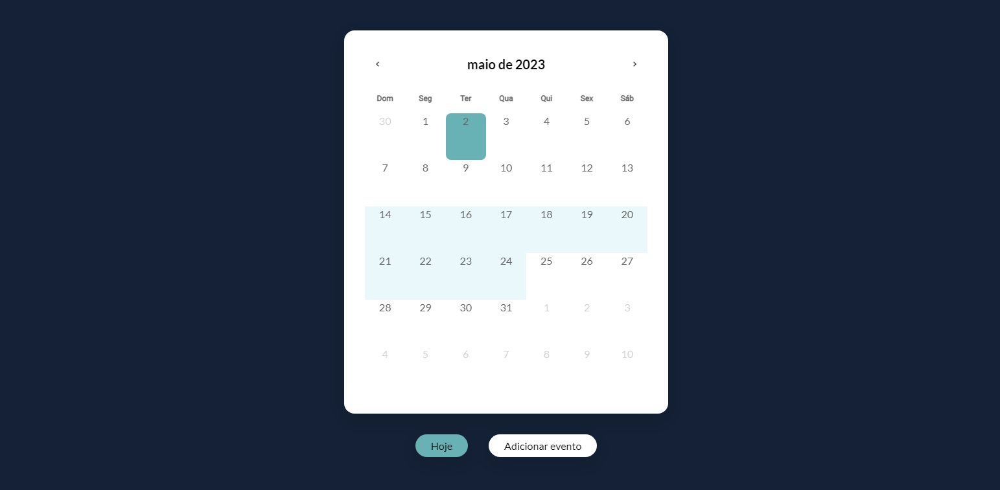

<h1 align="center"> 👾 #BoraCodar | Desafio 17 | Date Picker 👾 </h1>

    <i> "Desenvolva uma Date Picker / uma agenda" </i> 
      Este é o meu décimo sexto desafio <a href="https://boracodar.dev/">#BoraCodar</a> da RocketSeat.

## 🚀 Tecnologias

Esse projeto foi desenvolvido com as seguintes tecnologias:

- HTML
- CSS
- Animações CSS
- Javascript
- Github
- Figma

## 💻 Projeto

Criei este projeto com uma temática futebolísta. Uma página de contato de astros do futebol.  

Projeto construído a partir do layout proposto no desafio [#BoraCodar16](https://www.figma.com/community/file/1227809985897425342/%23boracodar---Desafio-16) realizado pela [Rocketseat](https://rocketseat.com.br).  

📌 Utilizei o HTML para marcação do site, CSS para estilização e para animações na página; utilizei o Figma como base da criação do projeto front-end e o Javascript para ações do usuário tais como exemplo a pesquisa por nome do contato.

## 📑 Deploy

Acesse o site [clicando aqui](https://brenobotelho.github.io/boracodar/desafio16/).

# 👤 Autor

**Breno Botelho**

👾 _Me siga nas redes sociais!_

- Github: [@brenobotelho](https://github.com/brenobotelho)
- Instagram: [@brenobotelho_](https://instagram.com/@brenobotelho_)
- Facebook: [Breno Botelho](https://facebook.com/BrenooBotelho)
- Linkedin: [Breno B.](https://br.linkedin.com/in/breno-botelho?trk=public_profile_browsemap)
