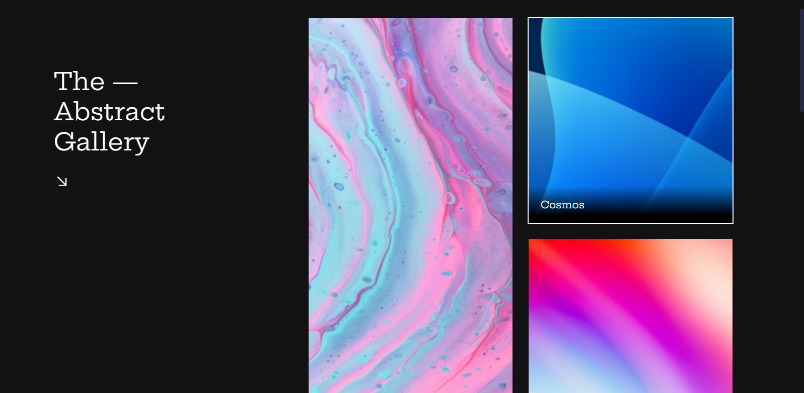

<h1 align="center"> 👾 #BoraCodar | Desafio 20 | Galeria com Hover 👾 </h1>

    <i> "Desenvolva uma Galeria com animação Hover" </i> 
      Este é o meu vigésimo desafio <a href="https://boracodar.dev/">#BoraCodar</a> da RocketSeat.

## 🚀 Tecnologias

Esse projeto foi desenvolvido com as seguintes tecnologias:

- HTML
- CSS
- Animações CSS
- Github
- Figma

## 💻 Projeto

Desenvolvi este projeto a partir do Layout proposto no Figma; utilizei imagens abstratas com animação hover ao passar o mouse.  

O projeto foi construído a partir do layout do Desafio [#BoraCodar20](https://www.figma.com/community/file/1235589928611910732/%23boraCodar---Desafio-20) realizado pela [Rocketseat](https://rocketseat.com.br).  

📌 Utilizei o HTML para marcação e estrutura do site, o CSS para a estilização e para animações do site, inclusive o hover e o Figma como base da criação do projeto e o 

## 📑 Deploy

Acesse o site [clicando aqui](https://brenobotelho.github.io/boracodar/desafio20/).

# 👤 Autor

[Breno Botelho](https://github.com/brenobotelho)

👾 _Me siga nas redes sociais!_

- Github: [@brenobotelho](https://github.com/brenobotelho)
- Instagram: [@brenobotelho_](https://instagram.com/@brenobotelho_)
- Facebook: [Breno Botelho](https://facebook.com/BrenooBotelho)
- Linkedin: [Breno B.](https://br.linkedin.com/in/breno-botelho?trk=public_profile_browsemap)
