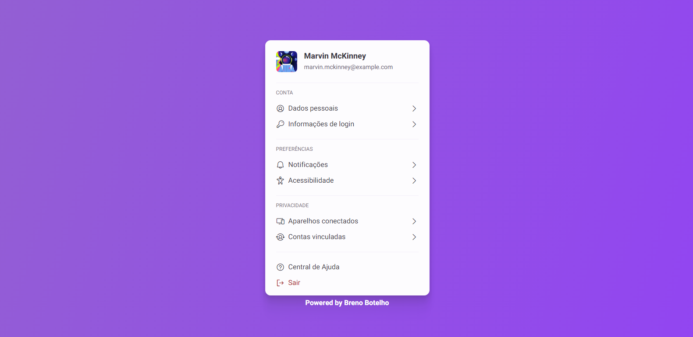

<h1 align="center"> 👾 #BoraCodar | Desafio 22 | Profile Settings 👾 </h1>

    <i> "Desenvolva um Profile Settings - Configuração de Perfil" </i> 
      Este é o meu vigésimo segundo desafio <a href="https://boracodar.dev/">#BoraCodar</a> da RocketSeat.

## 🚀 Tecnologias

Esse projeto foi desenvolvido com as seguintes tecnologias:

- HTML
- CSS
- Github
- Figma

## 💻 Projeto

Desenvolvi um site de Configuração de Perfil  

Nele é exibido uma lista de configurações onde se pode editar;

Construído a partir do layout proposto no desafio [#BoraCodar22](https://www.figma.com/community/file/1245736372337157133/Profile-Settings--%E2%80%A2-Desafio-22) realizado pela [Rocketseat](https://rocketseat.com.br).  

📌 Utilizei o HTML para marcação e estrutura do site, o CSS para a estilização e animações em hover e o Figma como base da criação do projeto.

## 📑 Deploy

Acesse o site [clicando aqui](https://brenobotelho.github.io/boracodar/desafio22/).

# 👤 Autor

[Breno Botelho](https://github.com/brenobotelho)

👾 _Me siga nas redes sociais!_

- Github: [@brenobotelho](https://github.com/brenobotelho)
- Instagram: [@brenobotelho_](https://instagram.com/@brenobotelho_)
- Facebook: [Breno Botelho](https://facebook.com/BrenooBotelho)
- Linkedin: [Breno B.](https://br.linkedin.com/in/breno-botelho?trk=public_profile_browsemap)
