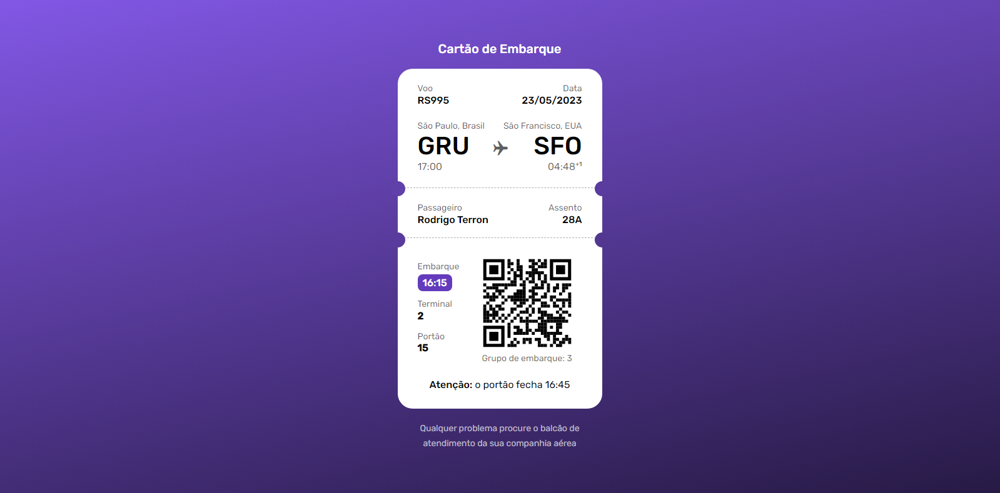

# #BORACODAR

**Cartão de embarque:** _"Desenvolva uma tela onde um usuário visualiza um cartão de embarque. Use sua criatividade e fique à vontade para ir além nesse projeto."_

Esse é o meu desafio #boraCodar.

Utilizei as tecnologias de HTML5 e CSS3. Inspirado pelo Figma, fui desenhando o site conforme suas medidas em pixels e tendo como sucesso o resultado esperado.

