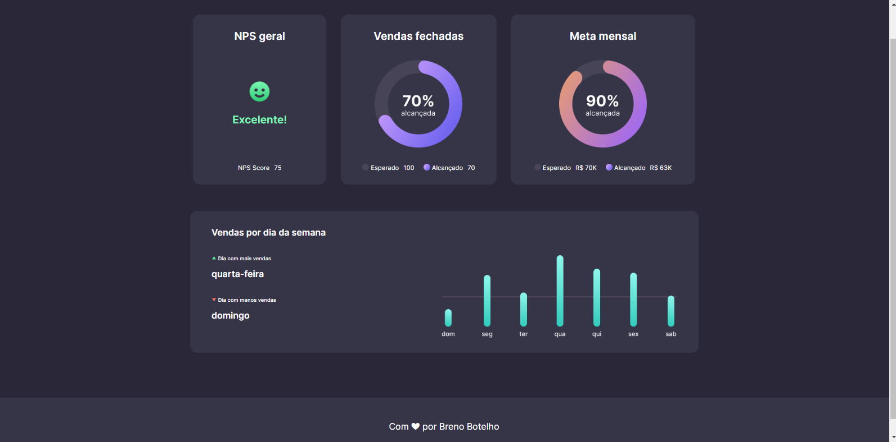

<h1 align="center"> 👾 #BoraCodar | Desafio 8 | Dashboard 👾 </h1>

    <i> "Desenvolva uma tela de Dashboard de vendas." </i> 
      Esse é o meu oitavo desafio <a href="https://boracodar.dev/">#BoraCodar</a> da RocketSeat.

## 🚀 Tecnologias

Esse projeto foi desenvolvido com as seguintes tecnologias:

- HTML
- CSS
- Github
- Figma

## 💻 Projeto

Este Dashboard tem como objetivo mostrar dados de vendas, status de excelência, metas mensais e vendas fechadas.  

Projeto construído a partir do layout proposto no desafio [#BoraCodar9](https://boracodar.dev/) realizado pela [Rocketseat](https://rocketseat.com.br).  
Utilizei o HTML para marcação do site, CSS para estilização e o Figma como base do projeto.

## 📑 Deploy

Acesse o site [clicando aqui](https://brenobotelho.github.io/boracodar/desafio8/).

# 👤 Autor

**Breno Botelho**

👾 _Me siga nas redes sociais!_

- Github: [@brenobotelho](https://github.com/brenobotelho)
- Instagram: [@brenobotelho_](https://instagram.com/@brenobotelho_)
- Facebook: [Breno Botelho](https://facebook.com/BrenooBotelho)
- Linkedin: [Breno B.](https://br.linkedin.com/in/breno-botelho?trk=public_profile_browsemap)
