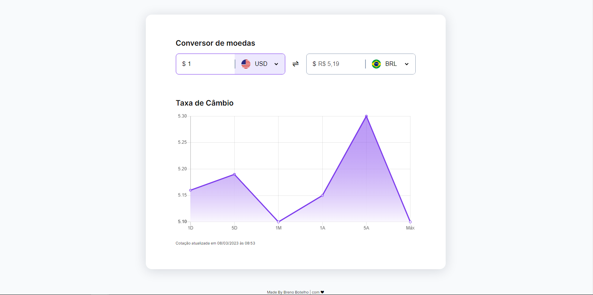

<h1 align="center"> 👾 #BoraCodar | Desafio 9 | Conversor de Moedas 👾 </h1>

    <i> "Desenvolva um Conversor de Moedas" </i> 
      Esse é o meu nono desafio <a href="https://boracodar.dev/">#BoraCodar</a> da RocketSeat.

## 🚀 Tecnologias

Esse projeto foi desenvolvido com as seguintes tecnologias:

- HTML
- CSS
- JavaScript
- APIs
- Chart.JS
- Github
- Figma

## 💻 Projeto

Este site tem como objetivo a conversão de moedas onde permite ao usuário calcular o valor das moedas em tempo real.  

Projeto construído a partir do layout proposto no desafio [#BoraCodar9](https://boracodar.dev/) realizado pela [Rocketseat](https://rocketseat.com.br).  

📌 Utilizei o HTML para marcação do site, CSS para estilização, o Figma como base da criação do projeto e criei funções a partir do Javascript:  
- Foi criado a função de conversão a partir de uma API em tempo real; 
- Criado função de troca de ícone do país ao selecionar a opção; 
- Função de mostrar a data e hora de agora e horário de cotação atualizada; 
- Utilização do gráfico Line do Chart.JS para dados de taxas de câmbio;

## 📑 Deploy

Acesse o site [clicando aqui](https://brenobotelho.github.io/boracodar/desafio8/).

# 👤 Autor

**Breno Botelho**

👾 _Me siga nas redes sociais!_

- Github: [@brenobotelho](https://github.com/brenobotelho)
- Instagram: [@brenobotelho_](https://instagram.com/@brenobotelho_)
- Facebook: [Breno Botelho](https://facebook.com/BrenooBotelho)
- Linkedin: [Breno B.](https://br.linkedin.com/in/breno-botelho?trk=public_profile_browsemap)
